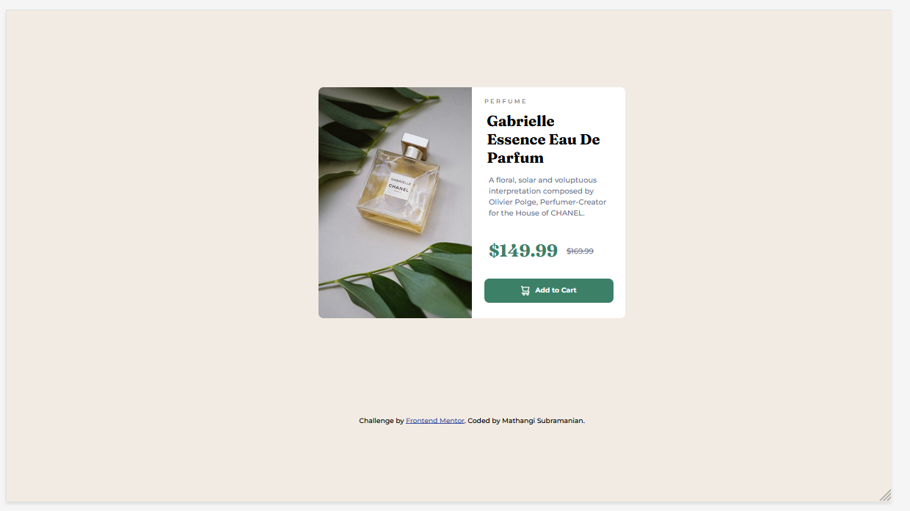
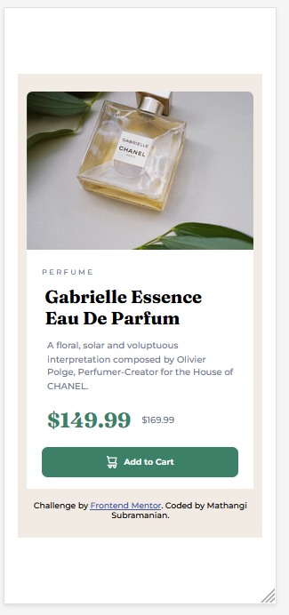

# Frontend Mentor - Product preview card component solution

This is a solution to the [Product preview card component challenge on Frontend Mentor](https://www.frontendmentor.io/challenges/product-preview-card-component-GO7UmttRfa). Frontend Mentor challenges help you improve your coding skills by building realistic projects. 

## Table of contents

- [Overview](#overview)
  - [The challenge](#the-challenge)
  - [Screenshot](#screenshot)
  - [Links](#links)
- [My process](#my-process)
  - [Built with](#built-with)
  - [What I learned](#what-i-learned)
  - [Continued development](#continued-development)
  - [Useful resources](#useful-resources)
- [Author](#author)
- [Acknowledgments](#acknowledgments)

## Overview
### The challenge

Users should be able to:

- View the optimal layout depending on their device's screen size
- See hover and focus states for interactive elements
### Screenshot

### 
Desktop view
 

### 
Mobile View
 

# 
### Links

- Solution URL : [Product Preview Card Code](https://github.com/mathangisd/product-preview-card-component-main.git)
- Live URL : [Product Preview Card Component on Netlify](https://product-preview-card-msd.netlify.app/)

## My process
### Built with

- Semantic HTML5 markup
- CSS custom properties
- CSS Grid
- CSS Flexbox
- Media Query
- Hover and Focus state for button

### What I learned

I used the media query to change the layout for desktop size. I was also able to use flexbox and grid properties.

### Continued-Development
I would like to keep working on other projects that involve different responsive layouts and also follow accessibility best practices.

### Useful resources

- [HTML and CSS course](https://www.youtube.com/watch?v=-8ORfgUa8ow&list=PLnHJACx3NwAdT_8forzXYvx0o4A2VnoHX) - by amazing instructor [John Smilga](https://johnsmilga.com/) - This course helped me understand many basics and advanced concepts of HTML and CSS.

- [CSS Button style Hover and Focus](https://www.freecodecamp.org/news/css-button-style-hover-color-and-background/) - by Dionysia Lemonaki - This article explains button styles for different states.

## Author
- Website - [Mathangi Subramanian](https://github.com/mathangisd)
- Frontend Mentor - [mathangisd](https://www.frontendmentor.io/profile/mathangisd)

## Acknowledgments
I was able to understand many concepts from [John Smilga's](https://johnsmilga.com/) projects. 
Thank you to anyone for giving any feedback, it is always helpful to know how the code could be improved.